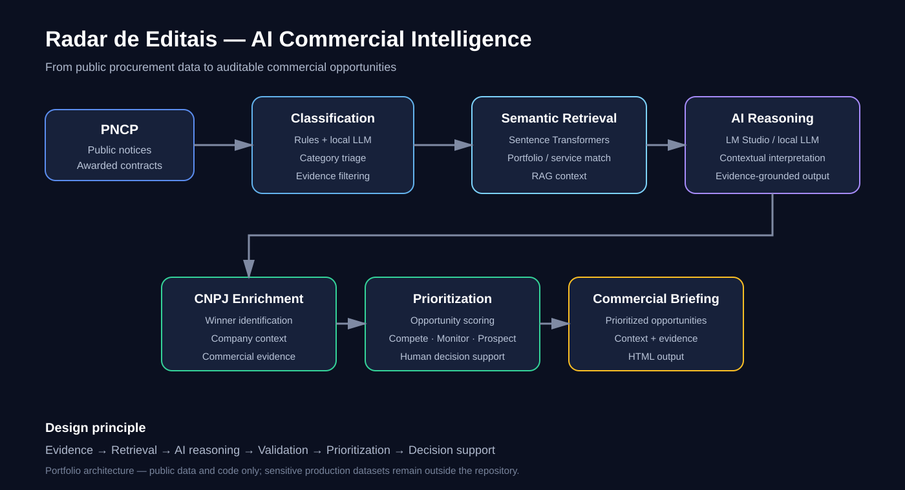

# Radar de Editais — Public Procurement Intelligence with AI

> Applied AI system that transforms public procurement data into **commercial opportunities, semantic matches and prioritized intelligence** for industrial organizations.

**Portfolio focus:** Applied AI · RAG · Semantic Search · LLMs · LangGraph · Data Intelligence · Decision Support



---

## Business problem

Public procurement creates a large volume of notices, awarded contracts and supplier information. Manually reading these sources makes it difficult to identify, at scale:

- opportunities an organization can directly pursue;
- awarded suppliers that may become potential clients;
- procurement categories aligned with an organization's portfolio;
- companies already active in relevant public contracts.

The project explores how **data pipelines + semantic retrieval + local LLM reasoning** can turn this information into a structured commercial intelligence workflow.

## Solution

The system monitors public procurement information from the **PNCP** and organizes the intelligence into three commercial paths:

1. **Compete** — opportunities the organization may be able to serve directly.
2. **Monitor** — open opportunities where the winning company may become a prospect.
3. **Prospect** — companies that have already won relevant public contracts.

The final output is a prioritized HTML briefing designed to support human commercial analysis.

## Architecture

The architecture above summarizes the main pipeline from public procurement data to decision support.

```text
PNCP public data
      │
      ▼
Data collection
      │
      ├── Open procurement notices
      └── Awarded contracts
      │
      ▼
Rule-based + LLM classification
      │
      ▼
Semantic retrieval / RAG
      │
      ├── Sentence-transformer embeddings
      └── Local LLM reasoning via LM Studio
      │
      ▼
CNPJ enrichment
      │
      ▼
Opportunity prioritization
      │
      ▼
Commercial intelligence briefing
```

### Main components

| Component | Role |
|---|---|
| PNCP collector | Retrieves public procurement information |
| Classification layer | Combines deterministic rules with local LLM classification |
| Semantic matching | Finds relevant portfolio/services using vector representations |
| Local LLM | Supports contextual interpretation of retrieved evidence |
| CNPJ enrichment | Connects procurement winners with company information |
| Prioritization | Produces a structured commercial opportunity score |
| HTML briefing | Converts analysis into a usable decision-support artifact |

## Engineering approach

A central design principle is to **separate evidence retrieval from generative reasoning**.

The system does not rely on an LLM to invent opportunities. Structured public data and deterministic rules establish the evidence; semantic retrieval identifies relevant context; the local LLM is then used to interpret that retrieved information.

This architecture makes the pipeline easier to inspect, test and evolve toward production.

## Technology stack

- Python
- Pandas
- LangGraph
- Sentence Transformers
- Vector / semantic search
- LM Studio
- Local LLM inference
- PNCP public data
- CNPJ-based enrichment
- HTML reporting

## Privacy and data governance

The repository contains the **application code and architecture**, not sensitive company or customer databases.

Production implementations should keep confidential datasets, credentials and personal/company contact information outside the public repository.

## How to run

```bash
pip install -r requirements.txt
```

Start a local model through LM Studio using an OpenAI-compatible endpoint, then run:

```bash
python src/radar_completo.py
```

The exact model and local endpoint can be configured according to the development environment.

## Why this project matters in a Data & AI portfolio

This project demonstrates a complete applied-AI pattern:

```text
Public data
    ↓
Data engineering
    ↓
Information retrieval
    ↓
Semantic matching
    ↓
LLM reasoning
    ↓
Prioritization
    ↓
Decision support
```

The important part is not simply using an LLM. It is designing a system in which **data, retrieval, deterministic logic and AI work together to produce auditable intelligence**.

## Current scope and limitations

This is a portfolio implementation focused on demonstrating the architecture and engineering approach. A production deployment would require additional evaluation of retrieval quality, classification accuracy, data freshness, monitoring, security, model performance and business outcomes.

---

**Author:** Wilton Costa    
**Focus:** Data Science · Applied AI · Machine Learning · Intelligence & Analytics
